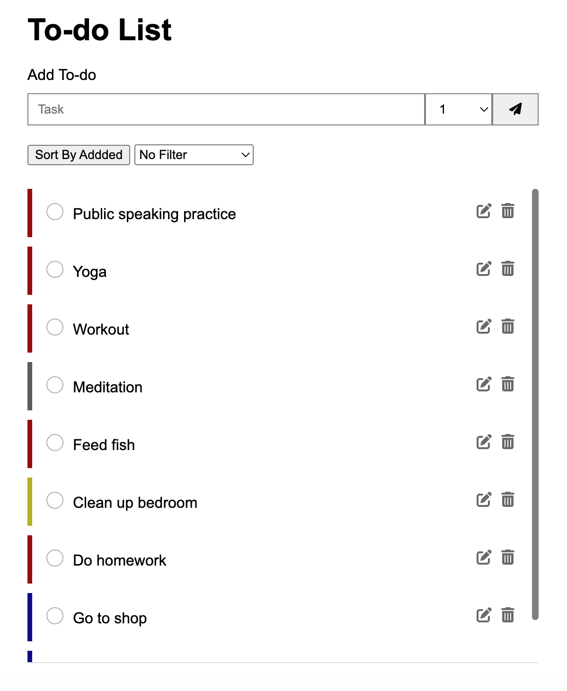

# To-do List
> Live demo [_here_](https://willyhardian.github.io/todolist/). <!-- If you have the project hosted somewhere, include the link here. -->

## Table of Contents
* [General Info](#general-information)
* [Technologies Used](#technologies-used)
* [Features](#features)
* [Screenshots](#screenshots)
* [Room for Improvement](#room-for-improvement)
* [Acknowledgements](#acknowledgements)
* [Contact](#contact)

## General Information
- App ideas to inspire students who learn basic web development
- Review HTML, CSS and JavaScript skills
- Make relevant app that people use daily

## Technologies Used
- HTML
- CSS
- Vanilla JavaScript
- Array of Objects (No Database)
- [Sweet Alert JavaScript](https://sweetalert2.github.io/)
- [Font Awesome](https://fontawesome.com/)

## Features
- Create new task
- Update task
- Delete task
- Complete task
- Priority of Task from 1-4. Priority 1 is the most important
- Sort by latest added or the first added
- Filter by priority

## Screenshots

<!-- If you have screenshots you'd like to share, include them here. -->

## Room for Improvement
- Add background customization
- Create better add and edit form with modal
- Create better UI
- Add date feature

## Acknowledgements
This project was inspired by https://todoist.com

## Contact
Created by [willyhardian](linkedin.com/in/willyhardian) - feel free to contact me!